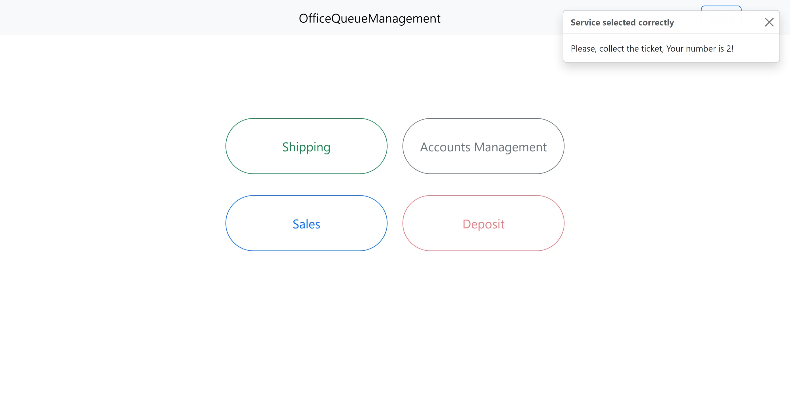
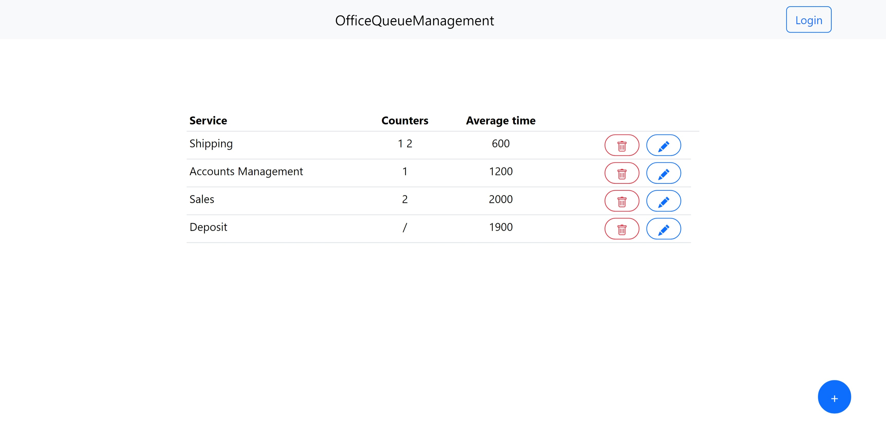
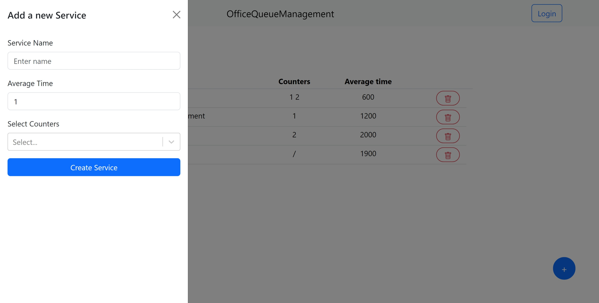
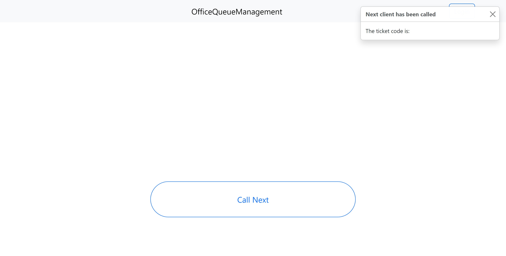
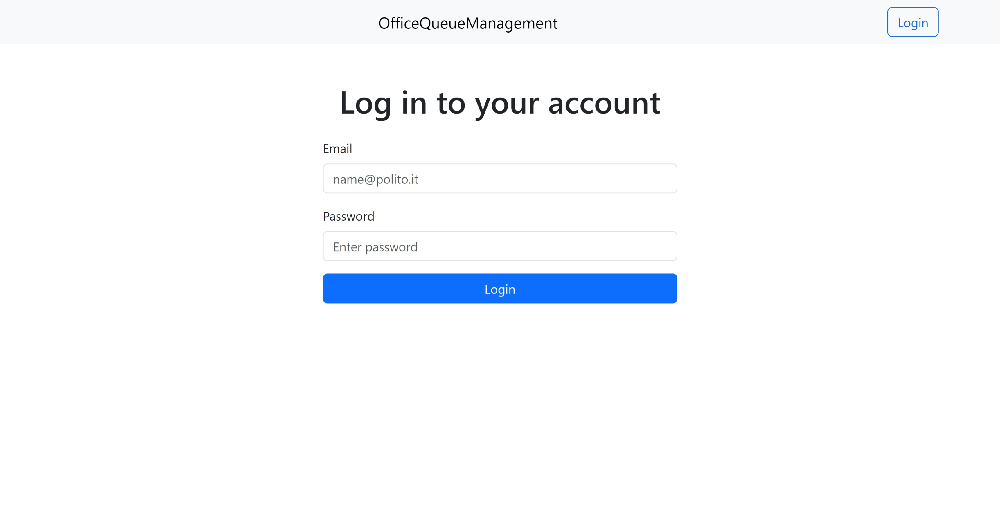

# SE2 - Office Queue Management
# Server side

## API Server

- GET `/api/employee`
  - request parameters: none
  - response body content: list of employees identified by id, name, surname and role 
- GET `/api/counter`
  - request parameters: none
  - response body content: list of counters identified by id, officer and name of the counter 
- GET `/api/services`
  - request parameters: none
  - response body content: list of the services including id, type of the service, the time needed to serve it and the list of counters that manage it
- POST `/api/service`
  - request body content: a sevice Object, which contains the service type and its time, and the counter list
  (it inserts a new service and updates the helpdesk)
- POST `/api/ticket`
  - request body content: contains the service we want to serve 
  (it inserts a new ticket)
- DELETE `/api/services/:idS/delete`
  - request parameters: id of the service
  (it deletes a service)

## Database Tables

- Table `employee` - contains the information of the employees (id_employee, name, surname, role)
- Table `counter` - contains the list of counters  (id_counter, officer, name)
- Table `service` - contains the list of services (id_service, service_type, service_time)
- Table `helpdesk` - contains the link between the service and the counter that manages it(counter, service)
- Table `ticket` - contains all the tickets  (id_ticket, service, customer_number)

# Client side

## React Client Application Routes

- Route `/`: main page which contains a navbar and the list of services that we can request a ticket for
- Route `/login`: login form 
- Route `/officer`: it displays the page with the point of view of the officer, where he can call the next client and see the ticket code
- Route `/admin`: it displays the page with the point of view of the admin, he sees all the services, can modify them and also create a new one
- Route `/*`: redirect the site to the homepage

## Main React Components

- `Home` (in `Home.jsx`): component that contains the list of services for which I can request a ticket by clicking on them, interface for the client
- `Admin` (in `Admin.jsx`): component where I can create a new service or edit/delete an existing one, interface for the admin
- `ServiceOffcanvas` (in `ServiceOffcanvas.jsx`): component that contains the form to create a new service
- `Officer` (in `Officer.jsx`): compontent that contains a button for calling the next client, interface for the officer
- `MyNavbar` (in `MyNavbar.jsx`): component that contains the layout of the webside, in particular the navbar with the title and login/logout button
- `Login` ( in `Login.jsx`): component that contains the login form

## Example Screenshot

### Home

### Admin

### Officer

### Login
